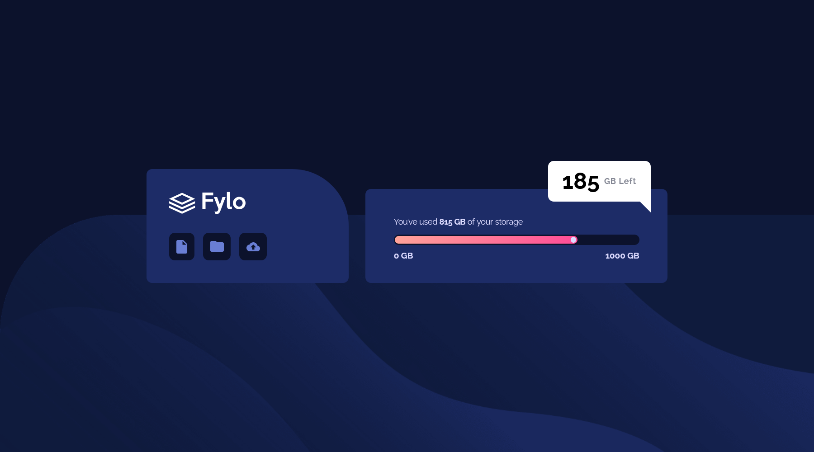

# Frontend Mentor - Fylo data storage component solution

This is a solution to the [Fylo data storage component challenge on Frontend Mentor](https://www.frontendmentor.io/challenges/fylo-data-storage-component-1dZPRbV5n). Frontend Mentor challenges help you improve your coding skills by building realistic projects.

## Table of contents

- [Overview](#overview)
  - [The challenge](#the-challenge)
  - [Screenshot](#screenshot)
  - [Links](#links)
- [My process](#my-process)
  - [Built with](#built-with)
  - [What I learned](#what-i-learned)
  - [Continued development](#continued-development)
  - [Useful resources](#useful-resources)
- [Author](#author)
- [Acknowledgments](#acknowledgments)

## Overview

This was my first project working with SASS, I discovered the power and importance of a preprocessorer and the utilities that it can offer, I highly recommand learning about SASS after having a basic knowledge about CSS.
I also discovered a great tool that help with the sizes of the design:[Pureref](https://www.pureref.com/download.php)
It's free but you can help them with any amoun topf money wich will help them to improve their work
I discovered this tool in a youtube channel that you can find in [Useful resources](#useful-resources)

### The challenge

Users should be able to:

- View the optimal layout for the site depending on their device's screen size

### Screenshot



### Links

- Solution URL: [Add solution URL here](https://your-solution-url.com)
- Live Site URL: [Add live site URL here](https://your-live-site-url.com)

## My process

### Built with

- Semantic HTML5 markup
- CSS custom properties
- Flexbox
- Mobile-first workflow

### What I learned

```css
.proud-of-this-css {
	/*very useful when you dont need a specific height for the container so you just make it take the height of the */
	height: fit-content;
}
```

```scss
// I learned how to import from another file in sass which miight be usefull to organize the code and maintain the scalability
@import "_media1440.scss";
```

If you want more help with writing markdown, we'd recommend checking out [The Markdown Guide](https://www.markdownguide.org/) to learn more.

### Continued development

I will work more with sass and get familiar with it , I am working on learning more about functions and mixins, maybe I will use them in my next projects

### Useful resources

- [Youtube-Video](https://www.youtube.com/watch?v=Yv7UMWbZCVI&t=1791s) - I discovered this youtube channel which has some frontEndMentors solutions, and it was my main reference during this project

- [Youtube](https://www.youtube.com) - Youtube is a very hellpful recources for all developers, I mean you just need to tape your bug or where did you have an issue and a ton of tutorials will appear.
- [Stackoverflow](https://stackoverflow.com/) - This is the place where almost all the developers of the word meet, lot of them have experiences and are willing to help but also lot of them are just looking for help, So it's a great community and great resource for sure.

## Author

- Website - [Njoura7](https://github.com/Njoura7)
- Frontend Mentor - [@Njoura7](https://www.frontendmentor.io/profile/Njoura7)

## Acknowledgments

Those are my instructors that I am following right now and who are helping me in almost every single step and project:

### Youtube channels:

[_Kevin Powell_](https://www.youtube.com/kepowob)

[_Web Dev Simplified_](https://www.youtube.com/c/WebDevSimplified)

[_Traversy Media_ ](https://www.youtube.com/c/TraversyMedia)

[_Dave Gray_](https://www.youtube.com/c/DaveGrayTeachesCode)
